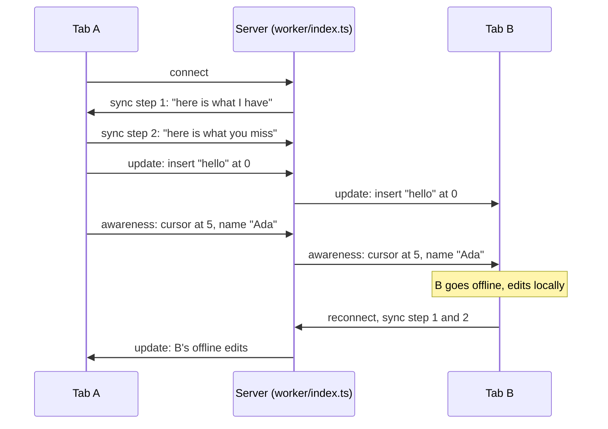

# cowrite

Two browser tabs edit one text document at the same time. Each tab sees the other user's cursor and name. A tab that goes offline keeps working and merges cleanly when it returns.

## Try it

Live demo: **https://ulot2.github.io/cowrite/**

1. Open the link in two tabs.
2. Type in one tab. The other tab follows, and shows your cursor with your name.
3. Click "Go offline" in one tab, type in both, then click "Reconnect". Both tabs end with the same text.

## Why this exists

Collaborative editing is a common feature, and most explanations of it stop at the theory.
This repo is the smallest complete version I could ship: one document, one server file, one test that proves the offline merge.
The goal is a demo that a recruiter can open in two tabs and understand in one minute.

## How it works

The document is a CRDT (a data structure that merges edits from any order to the same result). We use the [Yjs](https://github.com/yjs/yjs) library for that. Each tab holds a full copy of the document. The server holds a copy too, stores every change, and forwards changes between tabs over WebSockets (a two-way connection that stays open).

The server is one Cloudflare Durable Object (a small server with a name, one running copy, and its own SQLite database). All tabs of a document reach the same object, so edits pass through one place in order. The object sleeps between messages and keeps the sockets open.

Two channels flow through the server:

- Document updates. Each keystroke becomes a small binary update. Every tab applies every update, and Yjs guarantees that all tabs end with the same text, whatever the order of arrival.
- Awareness. Cursor position, name, and color. This channel is not stored. When a tab closes, its cursor disappears from the other tabs.

When a tab reconnects, the two sides exchange "state vectors" (a list of how many changes each side has seen from each client) and send only the missing updates. That is why the time offline does not matter.

Every update is one row in the object's database. On wake, the object replays the rows. After 200 rows it folds them into one row that holds the whole document.

## Run it locally

1. Install the dependencies with `npm install`.
2. Start the server with `npm run server`. It runs the Cloudflare runtime on your machine, on port 8787.
3. Start the page with `npm run dev`, then open http://localhost:5173 in two tabs.

## Deploy

1. Server: run `npx wrangler login` once, then `npm run deploy`. Wrangler prints the address, such as `https://cowrite.<you>.workers.dev`.
2. Page: set the repository variable `WS_URL` to that address with `wss://`, and the secret `CLOUDFLARE_API_TOKEN` to a Cloudflare API token with Workers edit rights. Then push to `main`. The CI workflow deploys the server and publishes the page to GitHub Pages.

## Tests

`npm test` starts the Cloudflare runtime on a free port and runs four tests over real WebSockets:

- One tab goes offline, both tabs edit, the tab returns. Both tabs end with the exact same text.
- Two offline tabs insert at the same position. Both inserts survive, and both tabs agree on one order.
- A tab that closes disappears from the other tab's presence list.
- A document written by one tab is still there for a new tab after every tab closed.

## Accessibility

- The editor is a native text box for screen readers, with a label, and it works with the keyboard alone. The Tab key moves focus and does not get trapped.
- The other user's cursor carries a text label with their name, not only a color.
- The status line (`role="status"`) announces connection changes and who is present.

## Limits

- One document, plain text, no accounts. That is the scope.
- Presence is kept in memory. After the object wakes, the list of who is here can take up to 15 seconds to fill.

## Stack

TypeScript, Vite, CodeMirror 6, Yjs, y-websocket. One Cloudflare Durable Object of about 130 lines as the server. Page on GitHub Pages, server on Cloudflare's free plan.
