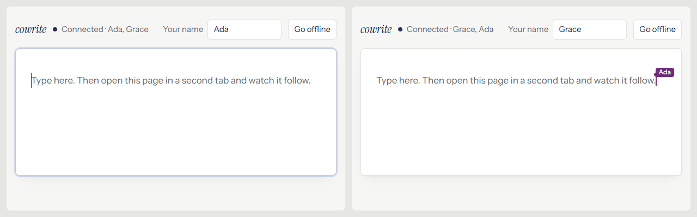
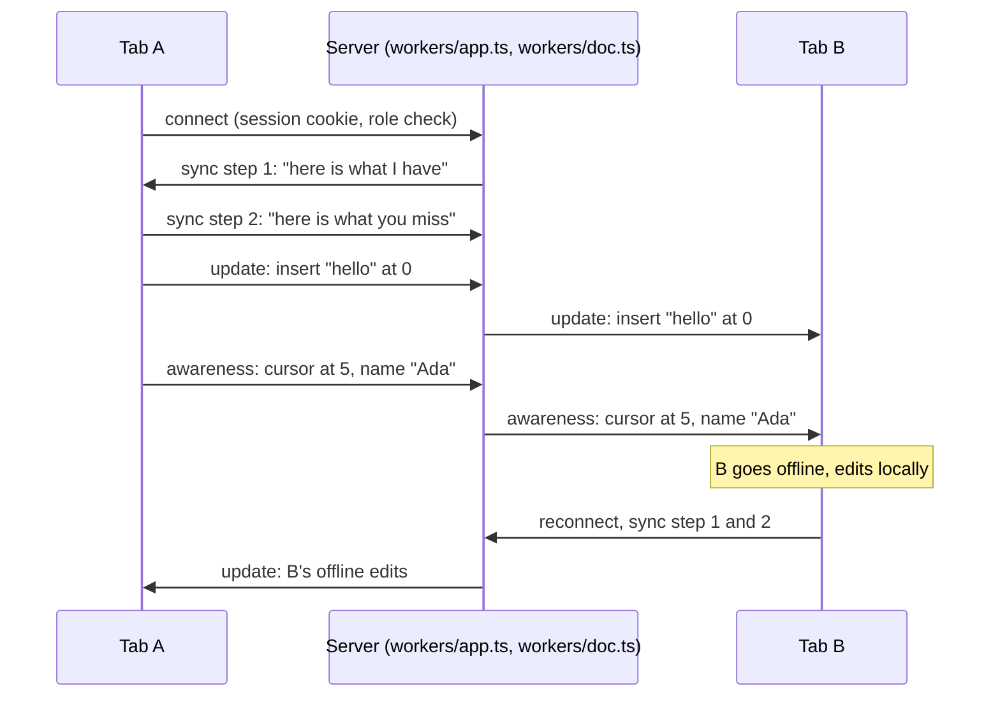

# cowrite

A shared writing tool. Sign in, create a document, and write it live with other people: headings, lists, quotes, code, tables, links, and images. Share a document by email or by link with a role (view, comment, review, edit), or group documents in a space with its own members. Select text to comment on it, reply, react, and resolve. Every document keeps its versions: one is saved automatically while you work, and you can name one, compare two, and restore any of them. A space shows who did what, day by day. Turn on "Suggest" and your edits become suggestions that an editor accepts or rejects; a reviewer always works that way. A document is a draft, in review, or approved, and a bell shows what other people did in your documents. Each person sees the others' cursors with their names. A tab that goes offline keeps working and merges cleanly when it returns.

*The recording shows the v1.0 demo page. The app now has accounts and a document list; the editor is the same.*

## Try it

Live: **https://cowrite.cowrite.workers.dev**

1. Create an account with an email and a password, or continue with GitHub.
2. Create a document and open it in two tabs.
3. Type in one tab, or press `/` for headings, lists, tables, and images. The other tab follows, and shows your cursor with your name.
4. Select a few words and use the comment button in the toolbar. The thread shows up in the other tab, in the text and in the Comments panel.
5. Click "Share", create a link for viewers, and open it in a private window with a second account. That account can read and follow your cursor, but not type.
6. Click "History". Name the current version, change a paragraph, compare the version to the current document, and restore it. The other tab changes without a reload.
7. Share the document with the second account as a reviewer. In that window, type a sentence: it shows as a suggestion in both windows. Accept it from the first window. Use the status pill to submit the document for review and approve it from the second window; the bell in the first window lists the approval.
8. Open "Share" and publish the document. Open the public link in a private window: no account needed. From the "⋯" menu, present it as slides (one per level-1 heading) or export it to Word, Markdown, text, or PDF. Search the Documents page for a word from the text or from a comment.
9. Type `/task` in a document, assign it to the second account, and give it a date. It shows on their Tasks page and in their bell; ticking it there ticks it in your open document. Type `/decision` to record a numbered decision. From "New", start a Brainstorm board or a Plan.
10. Meet Nib, the writing assistant. Select a sentence and click "Ask Nib" in the toolbar that appears, then choose "Make shorter" or type your own instruction, such as "translate to French". On an empty line, type `@nib write an intro for this plan` and press Enter. Each answer shows as a suggestion by Nib that you accept or reject. In a comment, type `@Nib` and a question: Nib replies in the thread a few seconds later.
11. Open Settings from the account menu. Upload a photo or pick an avatar color, and your cursor and comments change for everyone. Turn off the kinds of notifications you do not want, switch Nib off, or change the theme and the text size for this browser.
12. Make a space and open its Discussions tab. Ask "Launch in October or November?", pick who decides and a date: it shows under Open questions on the space home and in the other members' bells. Reply, turn a reply into a task for someone (it lands on their Tasks page), then mark the question answered.
13. Open the answered question's "Recorded as D-1" link: the decision has its own page with what was decided, who decided and when, and the whole discussion under "Why". Add a decision block to a document in the space (it becomes D-2), open it, and set "This replaces" to D-1. D-1 now says it was replaced, and the space's decision log shows only what is in force.

The v1.0 demo without accounts is tagged `v1.0.0`.

## Why this exists

Collaborative editing is a common feature, and most explanations of it stop at the theory.
This repo is the smallest complete version I could ship: one document, one server file, one test that proves the offline merge.
The goal is a demo that a recruiter can open in two tabs and understand in one minute.

## How it works

The landing page is plain HTML, CSS, and a little script in `public/landing/`, with no React. The Worker serves it at `/` to visitors without a session cookie, through the `ASSETS` binding; people who are signed in get their home at the same address. The FAQ's "Ask your own question" field posts to `/api/faq`, which needs no account. Nib answers only from a fixed text of facts about CoWrite, in `app/routes/api.faq.ts`. Each visitor can ask 5 questions a day and the page 100, so visitors cannot use up the AI allowance that the app needs. The questions and answers stay in the visitor's browser; the server keeps only the daily counts.

The playground (`/play`) is the full editor without an account. Each browser gets one page, a room named `play:<id>`, and the id is in an HttpOnly cookie. Only that browser can open the room, and it can export, print, and present it like a document. A playground room writes nothing to D1, and it deletes itself 7 days after its last edit.

The document is a CRDT (a data structure that merges edits from any order to the same result). We use the [Yjs](https://github.com/yjs/yjs) library for that. Each tab holds a full copy of the document. The server holds a copy too, stores every change, and forwards changes between tabs over WebSockets (a two-way connection that stays open).

The server is one Cloudflare Durable Object (a small server with a name, one running copy, and its own SQLite database). All tabs of a document reach the same object, so edits pass through one place in order. The object sleeps between messages and keeps the sockets open.

Two channels flow through the server:

- Document updates. Each keystroke becomes a small binary update. Every tab applies every update, and Yjs guarantees that all tabs end with the same text, whatever the order of arrival.
- Awareness. Cursor position, name, and color. This channel is not stored. When a tab closes, its cursor disappears from the other tabs.

When a tab reconnects, the two sides exchange "state vectors" (a list of how many changes each side has seen from each client) and send only the missing updates. That is why the time offline does not matter.

Every update is one row in the object's database. On wake, the object replays the rows. After 200 rows it folds them into one row that holds the whole document. Three seconds after an edit, the object writes the first lines of the text to D1 for the document cards.

The editor is [BlockNote](https://www.blocknotejs.org), which stores its blocks as a Yjs XML fragment, so the same merge rules cover rich text. Comment threads are a Yjs map in the same document, so they sync live and survive offline like the text. The object counts open threads for the document cards. Images go through the Worker to R2 (Cloudflare's file storage) under a random key, and the image block keeps the URL.

Around the objects sits one Cloudflare Worker that serves the React Router app. Accounts and sessions come from Better Auth on D1 (Cloudflare's SQL database). The `documents`, `memberships`, `spaces`, and `space_memberships` tables say who can open what, with one role ladder: viewer, commenter, reviewer, editor, owner. A person's role on a document is the highest of their direct role and their role on the document's space.

Versions live in the object too, in a `versions` table next to the update log. Each row is the whole document at one moment (`Y.encodeStateAsUpdate`). The object saves one by itself three seconds after the first edit, then at most once per half hour of work, and keeps the newest fifty of those; named versions stay. A restore copies the blocks of the old version over the live ones in one Yjs transaction, so it travels the normal update path and every open editor changes in place. The compare view is a block-level diff computed on the server.

Activity is a D1 table `events`, one row per thing that happened (created, renamed, shared, moved, edited, commented, version saved, restored), written by the Worker's actions and by the object's alarm. The Worker calls the object's methods directly (Durable Object RPC), so versions need no public API route.

Suggestions are marks on the text (`insertion`, `deletion`, `modification`, from [prosemirror-suggest-changes](https://github.com/handlewithcarecollective/prosemirror-suggest-changes)). While suggest mode is on, the editor turns every local edit into marks instead of a change; remote edits pass through untouched. Marks are ordinary Yjs formatting, so suggestions sync live and survive offline like the text, and the server does not know about them. A suggestion id starts with its author's user id, which is how the bar can say who suggested. Accept and reject turn the marks into real edits, and each one is logged, so the author hears about it through the bell. Hover a suggestion for a small card with the author and the two buttons; the bar above the text does the same for the keyboard.

Comments can mention a member: type `@` in a comment and pick a name. The comment editor has its own schema with a `mention` inline item, and the threads object scans new comments when its alarm runs and logs "mentioned Bea", which reaches her bell.

Outside the editor, the object reads its Yjs XML into a small tree of blocks and inline runs with their formatting (`app/lib/rich.ts`). Pending suggestions read as rejected, and only web, mail, and same-site links are kept. One React component draws that tree, so no HTML string is ever stored or served. The public page, print, slides, the history preview, and the Markdown, text, and Word exports (the `docx` package, on the server) all use it. Publishing saves a version named "Published" and the public page `/p/<slug>` shows that version, so later edits stay private until the owner updates the page.

Search is an SQLite FTS5 table in D1 with one row per document for its title, its text, and its comments. The two objects write their rows when their alarm runs; renames write the title. A query becomes quoted prefix terms, so no input is read as search syntax, and results are limited to the documents you can open.

Tasks and decisions are blocks inside the document, so they sync, merge offline, and live in versions like any text. The object's alarm writes an index of them to D1 (`tasks`, `decisions`) for the Tasks page and the decision log; a decision gets its number there (per space) and the object writes it back into the block. Ticking a task on the Tasks page asks the object over RPC to change the block, so open editors tick too. A brainstorm board is a document whose content is columns and cards (a Y.Array and a Y.Map) in the same object; it exports, publishes, and restores like a document.

Status is a column on the document row: Idea, Draft, In review, Approved, Done. Six moves (start drafting, submit, request changes, approve, mark done, reopen) are each checked against the role and the current status. A document made from an idea starts as Idea. While a document is in review, reviewers sign off each section (a heading and the blocks under it) with "agree" or a concern and a short note. The `signoffs` table keeps one row per person per section, with a hash of the section's text at the time, so the Outline panel can show a sign-off as "changed since". Approve is refused while any concern is open, and a move back to Draft deletes the sign-offs, so each review round starts clean. The bell reads the events table: everything other people did on documents and spaces you belong to since you last opened it. One tiny table holds that time per person; no notification rows are written.

The Worker checks the session and the role before it hands a WebSocket to an object. Text and comments are two rooms per document (`/ws/<id>` and `/ws/<id>/threads`), each its own object with its own write rule: text needs reviewer, comments need commenter. Below that, the object drops the socket's updates, so a commenter can comment and still cannot change a word. A reviewer can write to the text; their editor makes every edit a suggestion, but the server cannot tell a suggestion from an edit, so that rule holds only for the real app.

Nib, the AI assistant, runs on Cloudflare Workers AI (`@cf/meta/llama-3.3-70b-instruct-fp8-fast`, about 30 of the 10,000 free daily neurons a request) through one route, `/api/ai`, and one module, `app/lib/ai.server.ts`. Only people who can suggest (reviewer and up) may call it. A rewrite sends only the selected text, so the model cannot mix the rest of the document into its answer. The answer never changes the text directly: the editor inserts it as a suggestion whose id starts with `ai~`, so the existing bar shows "Suggested by Nib" and Accept and Reject work as for a person. A free instruction (`@nib …` in the text, or the field in the Nib menu) applies to the selection, or writes new blocks at the cursor from Markdown, with the document as context. A comment that mentions `@Nib` is found by the same alarm scan as other mentions; the threads object asks the model with the thread and the document, and adds the answer as a reply by the user `ai`. The Workers free plan gives 10,000 neurons a day; after that Nib says it is out of free uses until the next day, and nothing is billed.

Nib also reads a whole space (`app/lib/nib.server.ts`). The space room's alarm writes each discussion and the ideas board into the search index, under keys (`s:<space id>:…`) that the documents search never matches. "Ask the space" searches that index with any of the question's words, and builds numbered sources: the decisions in force, the open questions, then the best five matches, cut at 12,000 characters. The model cites the sources as [1], [2], and the page turns them into links. "Suggest next steps" reads a discussion and answers JSON (tasks and a decision). The server matches the names to members and drops bad dates, and nothing is created until a person adds a card. Nib's check compares a document with the decisions in force in its log and the space's open questions. A submit or the Nib menu marks the check pending in D1 and wakes the document's object, whose alarm runs the check and writes the findings back, so the request stays fast. A finding must name a decision or a question Nib was given, or it is dropped.

The space home opens with "Needs attention": the open questions, the documents in review, and the tasks that are late, due this week, or yours, built from queries the page already runs, with your own first. Under it, Nib's card holds "This week" (`app/lib/state.server.ts`): a short summary Nib writes from live facts (decisions from the last seven days, open and late questions, late tasks, documents in review with their concerns, and what is new) and the recent activity. The summary costs a model call, so it is saved on the space row. When a member with Nib on opens the Overview, and the summary is older than six hours and something happened since, the loader marks it pending and wakes the space room, whose alarm writes it. Refresh does the same at most every ten minutes. The same room logs new ideas: it remembers the cards it has seen, and its first run only learns them. Events carry an optional `link` to the discussion, decision, or ideas board they are about; the timeline and the bell open it. Events by Nib (the user `ai`) read as Nib.

Settings (`/settings`) keep what belongs to the account in D1 (`user_settings`: avatar color, muted notification kinds, Nib on or off) and what belongs to a device in the browser (theme, text size, compact sidebar), applied by a small script before the first paint. The name, the photo, the password, GitHub linking, and the list of signed-in devices go through Better Auth's own server calls. Muted kinds are filtered in the bell's SQL. Deleting an account deletes the documents and spaces the person owns (with their objects), their memberships and sessions; what they did stays in other timelines as "Deleted user".

A space has its own room, a third kind of object next to a document's text and comments rooms: `<space id>:space`, at `/ws/space/<id>`. It holds the space's discussions (each a Y.Map with its posts) and the tasks made from posts, so they sync live and merge offline like everything else. Commenters and up write; viewers read. The same room holds the space's ideas board, in the same shape as a board document (`groups` and `cards`), so `board.client.tsx` serves both. Its three columns are seeded the first time someone who can write opens the Ideas tab. An idea can become a discussion in the same room (the card and the discussion point at each other) or a document in the space. The room's alarm writes an index to D1 (`discussions`, and task rows with `space_id` and `discussion_id`) for the space home, the Tasks page, and the bell. A question is a discussion with an owner and a "decide by" date; the space home lists open questions first, late ones in red.

Decisions are records (`/decision/<id>`). A space has one numbered log fed from two places: decision blocks in its documents, and questions answered in its discussions (row id `q:<discussion id>`). Both alarms number them from the same sequence and write the number back into their source. A record keeps its outcome, who decided and when, where it came from, and what it replaces; "replaced by" is read back from the newer record, so the chain is stored once. The page reads the source discussion from the space's room over RPC, so the reason for a decision is always the original conversation.

## Run it locally

1. Install the dependencies with `npm install`.
2. Create `.dev.vars` with two lines: `BETTER_AUTH_SECRET=<any long random string>` and `BETTER_AUTH_URL=http://localhost:5173`.
3. Create the local database tables with `npx wrangler d1 migrations apply cowrite --local`.
4. Start everything with `npm run dev` (app, Worker, object, and database in one process), then open http://localhost:5173.

## Deploy

1. Run `npx wrangler login` once. Create the database with `npx wrangler d1 create cowrite` and put its id in `wrangler.jsonc`.
2. Set the secrets once: `npx wrangler secret put BETTER_AUTH_SECRET`, and for GitHub login `GITHUB_CLIENT_ID` and `GITHUB_CLIENT_SECRET` from a GitHub OAuth app whose callback is `https://<your address>/api/auth/callback/github`.
3. Apply the migrations with `npx wrangler d1 migrations apply cowrite --remote`, then `npm run deploy`.
4. For CI deploys, add the repository secret `CLOUDFLARE_API_TOKEN` (a token with Workers and D1 edit rights). Every push to `main` then runs the tests, the migrations, and the deploy.

## Tests

`npm test` builds the app, starts the Cloudflare runtime on a free port with a database of its own, signs up users through the real auth API, and runs sixty-one tests over real WebSockets. The tests set `AI_FAKE`, so they never call the model:

- One tab goes offline, both tabs edit, the tab returns. Both tabs end with the exact same text.
- Two offline tabs insert at the same position. Both inserts survive, and both tabs agree on one order.
- A tab that closes disappears from the other tab's presence list.
- A document written by one tab is still there for a new tab after every tab closed.
- A socket without a session gets 401, a socket for a document you cannot open gets 403.
- An image upload without a session gets 401; with one, the file comes back byte for byte.
- A comment thread made in one tab appears in the other, and a resolve travels back.
- The document card shows the open comment count that the object writes after a change.
- The users route (names for comment authors) needs a session.
- A viewer reads but cannot edit or comment; a commenter comments but cannot edit; a role change applies on the next connect.
- A share link turns a 403 into a 101 for whoever follows it, and sends signed-out people through login and back.
- A space shares its documents with its members and hides them from everyone else.
- The first edit gets an automatic version; a named version, a compare, and a restore work end to end, and the open tab changes without a reload.
- A viewer can read the history but gets 403 on save and restore.
- A rename and an edit show up on the space timeline and on the document's history.
- Deleting a document closes its sockets and wipes its object.
- A reviewer's text update arrives; a commenter's still does not.
- Status moves follow the ladder and the roles (403 otherwise), and each one is logged.
- The bell counts what other people did since it was last opened, and never your own actions.
- Accepting or rejecting a suggestion is logged for its author; only editors may log one.
- A mention in a comment becomes an event for the mentioned person.
- A published page needs no account, shows the published text until the owner updates it, drops unsafe links, and is gone after unpublish; only the owner publishes.
- Export gives Markdown, plain text, and a Word file; a stranger gets 404.
- Search finds a word from the text and from a comment, and nothing for a stranger.
- Slides split at level-1 headings, and "Note:" paragraphs stay off the slide.
- A task block reaches its assignee's Tasks page and bell, and ticking it there ticks the block in the open document; a stranger gets 404.
- Decisions get numbers per space, written back into the blocks and listed on the space page.
- Plan mode starts with the template; a board starts with three columns, a card made a task is on the Tasks page, and a card can become a document.
- The review queue lists documents waiting for you, not the ones you submitted.
- Only people who can suggest may ask the AI; unknown commands and empty input are refused; whole-document commands read the text from the object.
- A free instruction needs words and at most 500 characters.
- `@Nib` in a comment gets a reply by Nib in the same thread.
- A new name and photo show for everyone; a photo must be a file this app stored.
- Muted notification kinds stay out of the bell and its count.
- With Nib off, the AI route refuses.
- A password change needs the current password, and the new one signs in.
- Deleting an account needs the email typed, takes the owned documents, and signs the person out.
- Space members share a discussion live; a viewer's write is dropped; a stranger's socket gets 403.
- An open question shows on the space home with who decides and the date, and reaches other members' bells.
- A task made from a message reaches the Tasks page, and ticking it there ticks it in the room.
- Deleting a space takes its discussions and their tasks.
- An answered question becomes D-1, numbered back into the room, and its page shows the outcome and the discussion; a stranger gets 404.
- A decision block in the same space takes the next number.
- A newer decision can replace an older one: the older page says so and the log in force hides it; a viewer's link gets 403 and a cycle is refused.
- The space's ideas board seeds its columns once; an idea turned into a discussion reaches another member with its text; a viewer's idea is dropped.
- An idea becomes a document in the Idea state, and Start drafting moves it to Draft; a commenter cannot make one.
- A concern on a section blocks approval until it is withdrawn; a viewer cannot sign off, and a draft cannot be signed off.
- Approved moves to Done and reopens; going back to Draft clears the sign-offs.
- Asking the space names a document, a discussion, and a decision in force as sources; a stranger gets 404, and Nib off is refused.
- Next steps from a discussion map a proposed name to a member and keep a valid date; a viewer gets 403.
- Submitting for review runs Nib's check, which finds the decision the text goes against and links to it; a viewer cannot ask for a check.
- A document outside a space is checked against its owner's own decisions.
- Needs attention lists a late task and a document in review once each, and says "You" on your own task; an empty space opens on Get started.
- A visit writes Nib's summary in the room, and a second visit within hours does not start another.
- Refresh needs a commenter or up, and is refused again within ten minutes.
- Activity rows link to their discussion and decision; new ideas, ticks in a thread, and Nib's findings are recorded.

## Accessibility

- The editor is a native text box for screen readers, with a label, and it works with the keyboard alone. The Tab key moves focus and does not get trapped.
- The other user's cursor carries a text label with their name, not only a color.
- The status line (`role="status"`) announces connection changes and who is present.

## Limits

- Adding someone by email needs them to have an account already; no invitation email is sent.
- A mention is found by the comment's creation time on the writer's clock; a comment edited later to add a mention is not logged.
- A reviewer's suggest-only mode is enforced by the editor, not the server.
- The compare view shows each block as plain text; the preview of one version shows the formatting.
- Word exports link to images instead of embedding them.
- The sign-in email cannot be changed yet; that needs an email service to verify the new address.
- Uploaded images, profile photos included, stay in storage after they are replaced.
- A discussion message is plain text; no formatting or @mentions yet.
- Other people see a new sign-off when they reload the document, not live.
- A document made from an idea does not link back to its card.
- Answers from "Ask the space" are not saved.
- The space's search rows are rewritten whole on every change to its room.
- No email digest yet. The "This week" summary is what one would send.
- Events logged before a change keep their old shape: no link.
- Nib has no per-person limit. One person can use the whole free daily allowance.
- Nib reads at most 12,000 characters of a document.
- Presence is kept in memory. After the object wakes, the list of who is here can take up to 15 seconds to fill.

## Stack

TypeScript, React Router (framework mode), BlockNote, prosemirror-suggest-changes, Yjs, y-websocket, Better Auth. One Cloudflare Worker with a Durable Object per document, a D1 database, an R2 bucket for images, and Workers AI.
