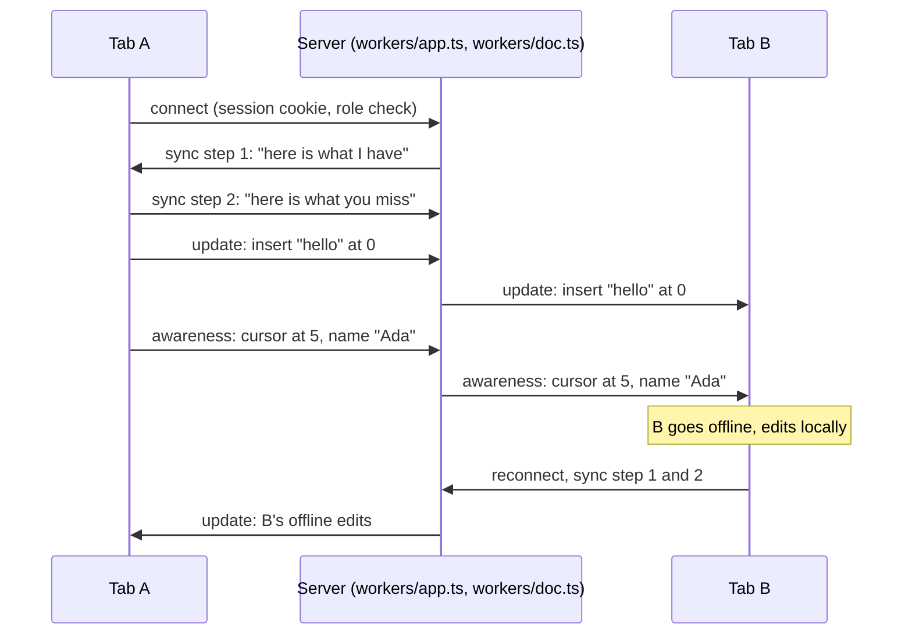

# cowrite

A shared writing tool. Sign in, create a document, and write it live with other people: headings, lists, quotes, code, tables, links, and images. Share a document by email or by link with a role (view, comment, review, edit), or group documents in a space with its own members. Select text to comment on it, reply, react, and resolve. Each person sees the others' cursors with their names. A tab that goes offline keeps working and merges cleanly when it returns.

*The recording shows the v1.0 demo page. The app now has accounts and a document list; the editor is the same.*

## Try it

Live: **https://cowrite.cowrite.workers.dev**

1. Create an account with an email and a password, or continue with GitHub.
2. Create a document and open it in two tabs.
3. Type in one tab, or press `/` for headings, lists, tables, and images. The other tab follows, and shows your cursor with your name.
4. Select a few words and use the comment button in the toolbar. The thread shows up in the other tab, in the text and in the Comments panel.
5. Click "Share", create a link for viewers, and open it in a private window with a second account. That account can read and follow your cursor, but not type.

The v1.0 demo without accounts is tagged `v1.0.0`.

## Why this exists

Collaborative editing is a common feature, and most explanations of it stop at the theory.
This repo is the smallest complete version I could ship: one document, one server file, one test that proves the offline merge.
The goal is a demo that a recruiter can open in two tabs and understand in one minute.

## How it works

The document is a CRDT (a data structure that merges edits from any order to the same result). We use the [Yjs](https://github.com/yjs/yjs) library for that. Each tab holds a full copy of the document. The server holds a copy too, stores every change, and forwards changes between tabs over WebSockets (a two-way connection that stays open).

The server is one Cloudflare Durable Object (a small server with a name, one running copy, and its own SQLite database). All tabs of a document reach the same object, so edits pass through one place in order. The object sleeps between messages and keeps the sockets open.

Two channels flow through the server:

- Document updates. Each keystroke becomes a small binary update. Every tab applies every update, and Yjs guarantees that all tabs end with the same text, whatever the order of arrival.
- Awareness. Cursor position, name, and color. This channel is not stored. When a tab closes, its cursor disappears from the other tabs.

When a tab reconnects, the two sides exchange "state vectors" (a list of how many changes each side has seen from each client) and send only the missing updates. That is why the time offline does not matter.

Every update is one row in the object's database. On wake, the object replays the rows. After 200 rows it folds them into one row that holds the whole document. Three seconds after an edit, the object writes the first lines of the text to D1 for the document cards.

The editor is [BlockNote](https://www.blocknotejs.org), which stores its blocks as a Yjs XML fragment, so the same merge rules cover rich text. Comment threads are a Yjs map in the same document, so they sync live and survive offline like the text. The object counts open threads for the document cards. Images go through the Worker to R2 (Cloudflare's file storage) under a random key, and the image block keeps the URL.

Around the objects sits one Cloudflare Worker that serves the React Router app. Accounts and sessions come from Better Auth on D1 (Cloudflare's SQL database). The `documents`, `memberships`, `spaces`, and `space_memberships` tables say who can open what, with one role ladder: viewer, commenter, reviewer, editor, owner. A person's role on a document is the highest of their direct role and their role on the document's space.

The Worker checks the session and the role before it hands a WebSocket to an object. Text and comments are two rooms per document (`/ws/<id>` and `/ws/<id>/threads`), each its own object with its own write rule: text needs editor, comments need commenter. Below that, the object drops the socket's updates, so a commenter can comment and still cannot change a word.

## Run it locally

1. Install the dependencies with `npm install`.
2. Create `.dev.vars` with two lines: `BETTER_AUTH_SECRET=<any long random string>` and `BETTER_AUTH_URL=http://localhost:5173`.
3. Create the local database tables with `npx wrangler d1 migrations apply cowrite --local`.
4. Start everything with `npm run dev` (app, Worker, object, and database in one process), then open http://localhost:5173.

## Deploy

1. Run `npx wrangler login` once. Create the database with `npx wrangler d1 create cowrite` and put its id in `wrangler.jsonc`.
2. Set the secrets once: `npx wrangler secret put BETTER_AUTH_SECRET`, and for GitHub login `GITHUB_CLIENT_ID` and `GITHUB_CLIENT_SECRET` from a GitHub OAuth app whose callback is `https://<your address>/api/auth/callback/github`.
3. Apply the migrations with `npx wrangler d1 migrations apply cowrite --remote`, then `npm run deploy`.
4. For CI deploys, add the repository secret `CLOUDFLARE_API_TOKEN` (a token with Workers and D1 edit rights). Every push to `main` then runs the tests, the migrations, and the deploy.

## Tests

`npm test` builds the app, starts the Cloudflare runtime on a free port with a database of its own, signs up users through the real auth API, and runs five tests over real WebSockets:

- One tab goes offline, both tabs edit, the tab returns. Both tabs end with the exact same text.
- Two offline tabs insert at the same position. Both inserts survive, and both tabs agree on one order.
- A tab that closes disappears from the other tab's presence list.
- A document written by one tab is still there for a new tab after every tab closed.
- A socket without a session gets 401, a socket for a document you cannot open gets 403.
- An image upload without a session gets 401; with one, the file comes back byte for byte.
- A comment thread made in one tab appears in the other, and a resolve travels back.
- The document card shows the open comment count that the object writes after a change.
- The users route (names for comment authors) needs a session.
- A viewer reads but cannot edit or comment; a commenter comments but cannot edit; a role change applies on the next connect.
- A share link turns a 403 into a 101 for whoever follows it, and sends signed-out people through login and back.
- A space shares its documents with its members and hides them from everyone else.

## Accessibility

- The editor is a native text box for screen readers, with a label, and it works with the keyboard alone. The Tab key moves focus and does not get trapped.
- The other user's cursor carries a text label with their name, not only a color.
- The status line (`role="status"`) announces connection changes and who is present.

## Limits

- Adding someone by email needs them to have an account already; no invitation email is sent.
- Mentions in comments come with notifications.
- Presence is kept in memory. After the object wakes, the list of who is here can take up to 15 seconds to fill.

## Stack

TypeScript, React Router (framework mode), BlockNote, Yjs, y-websocket, Better Auth. One Cloudflare Worker with a Durable Object per document, a D1 database, and an R2 bucket for images.
